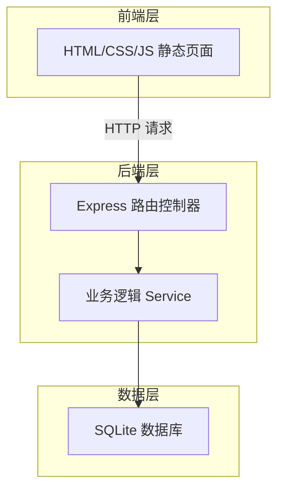
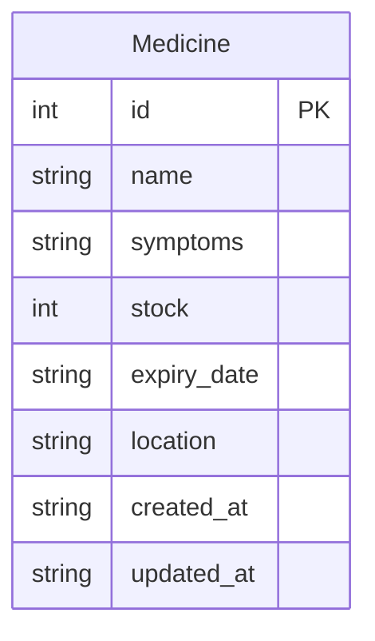

## 1. 架构设计



## 2. 技术说明

- **前端**：HTML5 + CSS3 + Vanilla JS，由 Express 静态文件服务托管
- **后端**：Node.js + Express@4
- **数据库**：SQLite3 (better-sqlite3)，文件存储于项目根目录 `data/medicine.db`
- **初始化工具**：npm init + 手动配置

## 3. 路由定义

| 路由 | 用途 |
|------|------|
| `/` | 仪表盘页面 |
| `/medicines` | 药品列表页面 |

## 4. API 定义

### 4.1 TypeScript 类型定义

```typescript
interface Medicine {
  id: number
  name: string
  symptoms: string
  stock: number
  expiry_date: string
  location: string
  created_at: string
  updated_at: string
}

interface MedicineCreateInput {
  name: string
  symptoms: string
  stock: number
  expiry_date: string
  location: string
}

interface MedicineUpdateInput {
  name?: string
  symptoms?: string
  stock?: number
  expiry_date?: string
  location?: string
}

interface DashboardStats {
  total: number
  expiring_soon: number
  low_stock: number
  expired: number
}
```

### 4.2 API 端点

| 方法 | 路径 | 描述 | 请求体 | 响应 |
|------|------|------|--------|------|
| GET | `/api/medicines` | 获取药品列表（支持筛选） | Query: `?symptom=&expiry_status=&stock_status=` | `Medicine[]` |
| GET | `/api/medicines/:id` | 获取单个药品 | - | `Medicine` |
| POST | `/api/medicines` | 新增药品 | `MedicineCreateInput` | `Medicine` |
| PUT | `/api/medicines/:id` | 编辑药品 | `MedicineUpdateInput` | `Medicine` |
| PATCH | `/api/medicines/:id/consume` | 消耗库存 | `{ amount: number }` | `Medicine` |
| PATCH | `/api/medicines/:id/restock` | 补货库存 | `{ amount: number }` | `Medicine` |
| DELETE | `/api/medicines/:id` | 删除药品 | - | `{ success: boolean }` |
| GET | `/api/dashboard/stats` | 仪表盘统计 | - | `DashboardStats` |
| GET | `/api/dashboard/expiring` | 即将过期药品 | - | `Medicine[]` |
| GET | `/api/dashboard/low-stock` | 低库存药品 | - | `Medicine[]` |

### 4.3 筛选参数说明

- `symptom`: 症状关键词，模糊匹配
- `expiry_status`: `expired`（已过期）/ `expiring_soon`（30天内过期）/ `safe`（安全）
- `stock_status`: `low`（库存≤3）/ `normal`（库存>3）

## 5. 服务端架构图

```mermaid
flowchart LR
    "Router" --> "Controller"
    "Controller" --> "Service"
    "Service" --> "Repository (better-sqlite3)"
    "Repository" --> "SQLite DB"
```

## 6. 数据模型

### 6.1 数据模型定义



### 6.2 数据定义语言

```sql
CREATE TABLE IF NOT EXISTS medicines (
  id INTEGER PRIMARY KEY AUTOINCREMENT,
  name TEXT NOT NULL,
  symptoms TEXT NOT NULL DEFAULT '',
  stock INTEGER NOT NULL DEFAULT 0,
  expiry_date TEXT NOT NULL,
  location TEXT NOT NULL DEFAULT '',
  created_at TEXT NOT NULL DEFAULT (datetime('now', 'localtime')),
  updated_at TEXT NOT NULL DEFAULT (datetime('now', 'localtime'))
);

CREATE INDEX IF NOT EXISTS idx_medicines_expiry_date ON medicines(expiry_date);
CREATE INDEX IF NOT EXISTS idx_medicines_stock ON medicines(stock);
CREATE INDEX IF NOT EXISTS idx_medicines_name ON medicines(name);
```
